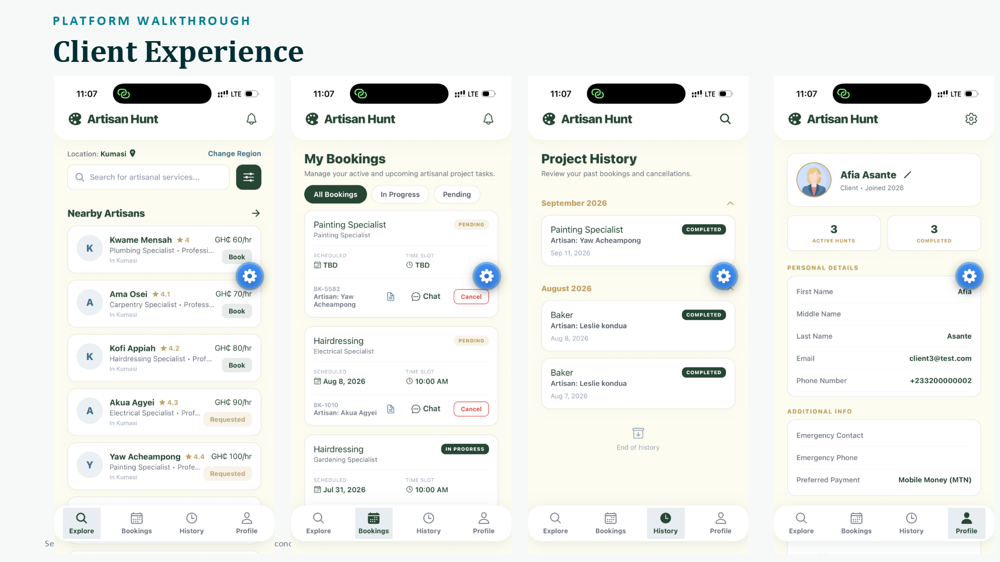
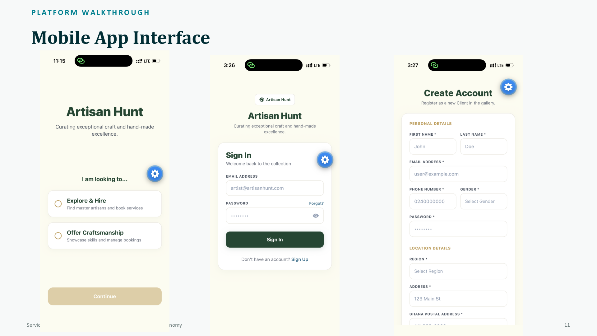
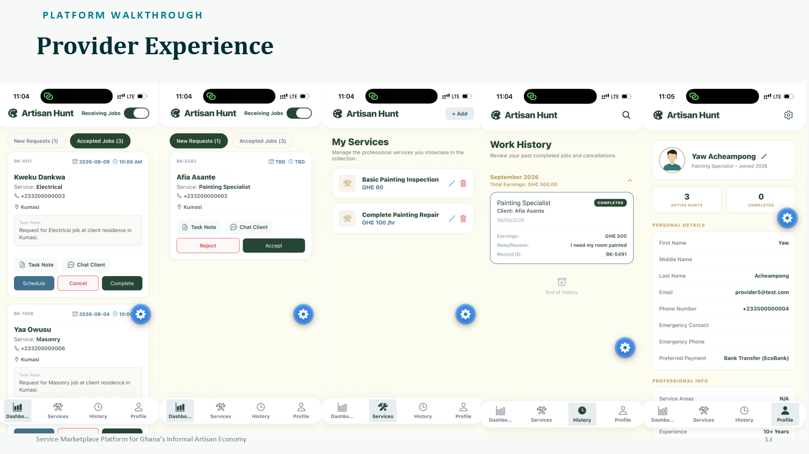
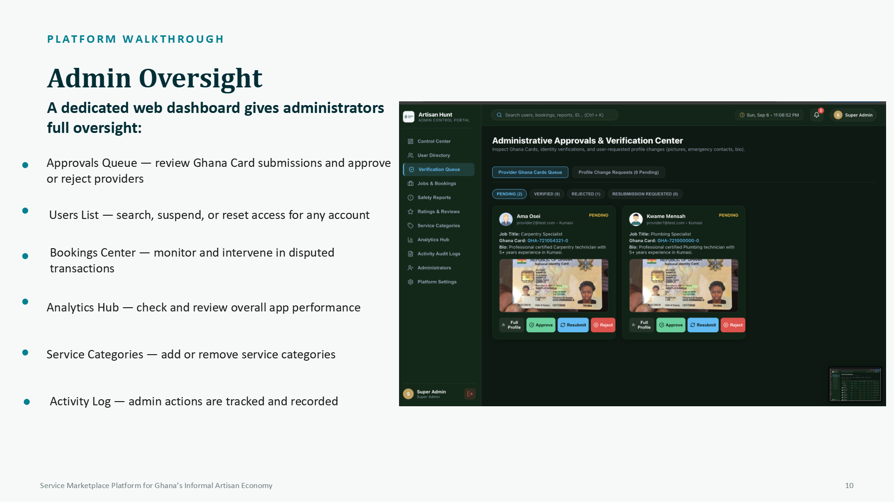

# Artisan Hunt

> **A service marketplace platform connecting customers with verified skilled artisans in Ghana.**

Artisan Hunt is a collaborative final-year project designed to make it easier for customers to discover, request, and manage services from skilled artisans, while giving service providers tools to manage jobs, services, profiles, and work history.

The platform includes a **React Native mobile application**, a **Node.js/Express backend**, and a **web-based administration dashboard**.

---

## 📱 Platform Preview

### Client Experience

Customers can discover nearby artisans, manage bookings, review project history, and manage their profiles.


### Mobile App Interface

The mobile application includes onboarding, authentication, and account registration flows.


### Provider Experience

Service providers can receive and manage requests, accept jobs, manage their services, review completed work, and maintain their profiles.


### Admin Dashboard

Administrators have centralized tools for user management, KYC/identity verification, bookings, service categories, safety reports, analytics, and activity monitoring.


---

## ✨ Key Features

### Customer
- Discover and search for artisans by service
- View artisan profiles and service information
- Request and manage bookings
- Track booking status
- View project history
- Manage personal profile information

### Service Provider
- Receive and manage job requests
- Accept or reject requests
- Schedule and manage jobs
- Create and manage service offerings
- Track completed work and earnings
- Manage professional profile information

### Administration
- Review provider verification/KYC submissions
- Approve, reject, or request resubmission of verification
- Manage users and access
- Monitor jobs and bookings
- Manage service categories
- Review reports and platform activity
- Access analytics and administrative controls

---

## 👨🏾‍💻 My Contributions

As a member of the development team, my contributions included:

- **Frontend Development:** Worked on the user-facing interface and application experience.
- **KYC Verification:** Contributed to the implementation of the Know Your Customer (KYC) verification functionality.
- **Authentication & Security:** Implemented password hashing using **bcrypt** to securely handle user passwords.
- **Backend Development:** Contributed to backend development with the assistance of AI development tools, then reviewed, tested, modified, and integrated the generated code into the application.
- **Testing & Debugging:** Helped test features, identify issues, and integrate working changes.
- **Version Control:** Used Git and GitHub for collaborative development and source-code management.

> **Note:** Artisan Hunt was developed collaboratively. The contribution list above describes my areas of involvement rather than claiming sole ownership of the entire project.

---

## 🛠️ Technologies Used

| Technology | Purpose |
|---|---|
| React Native | Cross-platform mobile application |
| JavaScript | Application and backend programming |
| Node.js | Backend runtime |
| Express.js | Backend API framework |
| MongoDB | Database |
| bcrypt | Password hashing |
| JWT | Authentication/token handling |
| Git & GitHub | Version control and collaboration |
| React | Web administration interface |

---

## 🏗️ Project Structure

```text
Artisan-Hunt/
├── admin/          # Web-based administration dashboard
├── backend/        # Node.js / Express backend API
├── mobile/         # React Native mobile application
├── README.md
└── .gitignore
```

---

## 🚀 Running the Project Locally

### Prerequisites

Install the following before running the project:

- Node.js
- npm
- Git
- Expo Go (for testing the React Native application)
- MongoDB or the project's configured MongoDB connection

### 1. Clone the repository

```bash
git clone https://github.com/cnworu86-spec/Artisan-Hunt.git
cd Artisan-Hunt
```

### 2. Install backend dependencies

```bash
cd backend
npm install
```

Create the required environment configuration based on the variables expected by the backend.

**Do not commit real passwords, database credentials, Firebase service-account files, API keys, or other secrets to GitHub.**

Start the backend using the project's configured start/development command, for example:

```bash
npm run dev
```

or, if the project uses the standard start script:

```bash
npm start
```

### 3. Run the mobile application

From the mobile directory:

```bash
cd ../mobile
npm install
npx expo start
```

Then scan the Expo QR code with Expo Go or use an Android emulator.

### 4. Run the admin dashboard

From the admin directory:

```bash
cd ../admin
npm install
npm run dev
```

The terminal will display the local URL for the dashboard.

> **Configuration note:** Exact environment variables, database configuration, ports, and Firebase settings depend on the project's current source configuration. Check the `backend`, `mobile`, and `admin` package files and environment setup before running the system.

---

## 🔐 Security

Sensitive configuration should be kept outside the public repository.

Examples include:

- Database credentials
- JWT secrets
- Firebase service-account credentials
- API keys
- Private tokens
- Production passwords

Use `.env` files or another secure secrets-management method and keep them excluded through `.gitignore`.

---

## 🎯 Project Goal

Artisan Hunt was developed to help bridge the gap between customers looking for skilled services and artisans looking for legitimate work opportunities.

The project focuses on:

- Easier discovery of skilled artisans
- More organized service requests and bookings
- Provider verification
- Secure authentication
- Administrative oversight
- A better digital experience for Ghana's informal artisan economy

---

## 📌 Project Status

Artisan Hunt is a completed collaborative final-year project and serves as a demonstration of full-stack application development involving mobile, backend, database, authentication, verification, and administration components.

---

## 👤 Author / Contributor

**Charles Nworu**  
BSc Computer Science Graduate

GitHub: https://github.com/cnworu86-spec

Project: https://github.com/cnworu86-spec/Artisan-Hunt

---

## 📄 License

This project was developed as an academic final-year project. Refer to the repository and project documentation for usage and ownership details.## 📱 Application Screenshots

### Client Experience


### Mobile App Interface


### Provider Experience


### Admin Dashboard

